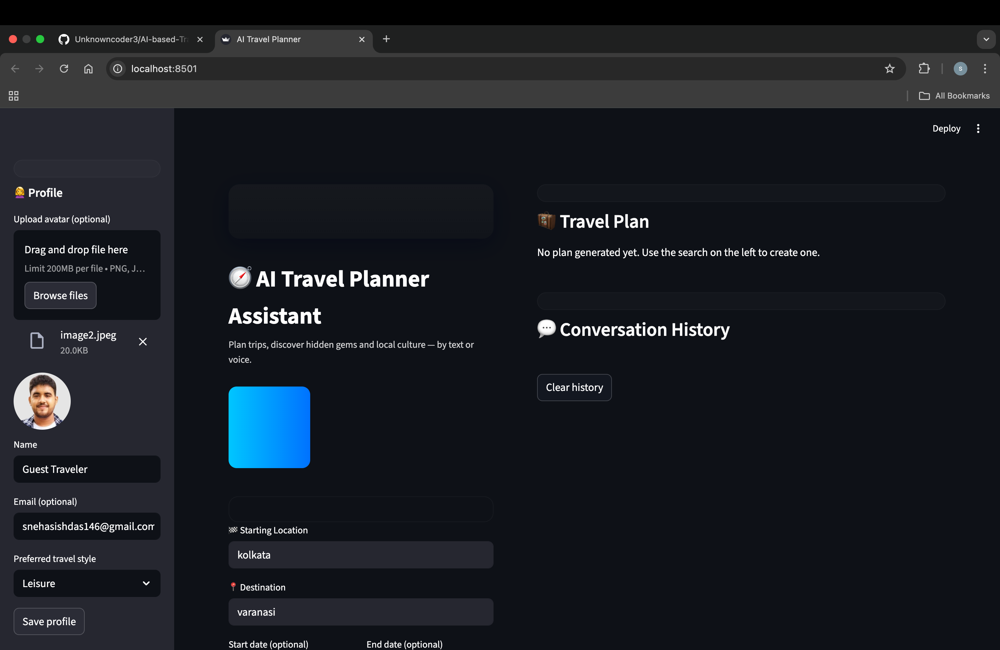
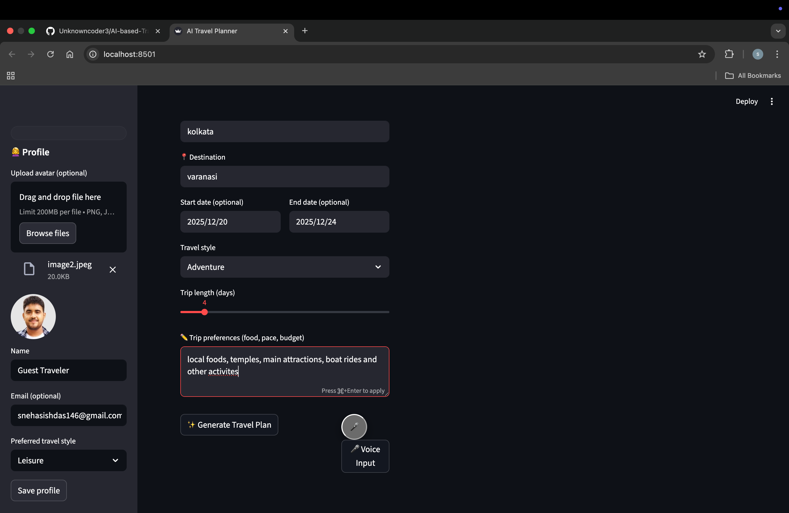
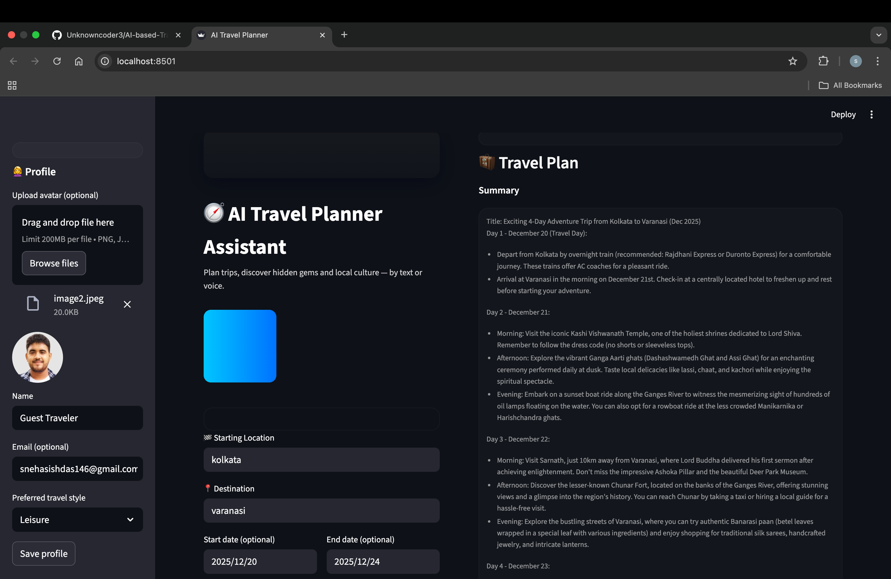
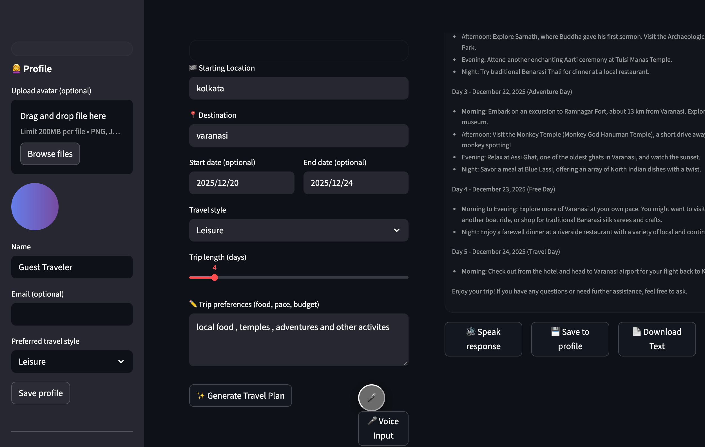

# 🌍 AI-Based Travel Planner

<p align="center">
  <b>Personalized travel planning with Python, Flask, data processing and recommendation logic.</b>
</p>

<p align="center">
  <a href="https://globetrotter.streamlit.app/">Live Demo</a> •
  <a href="https://github.com/Unknowncoder3/AI-based-Travel-Planner">Repository</a>
</p>

---

## 📌 Overview

AI-Based Travel Planner is a web application that helps users build personalized travel plans from preferences such as destination, budget, duration and interests.

The project combines **data processing, recommendation logic, external information sources and a browser-based interface** into an end-to-end travel planning workflow.

---

## ✨ Features

- 🧠 Personalized itinerary generation
- 💰 Budget-aware planning
- 📅 Trip-duration based recommendations
- ❤️ Interest-based activity suggestions
- 🌦️ Weather information integration
- 📍 Location/activity recommendations
- 🖥️ Web-based user interface
- ⚡ Lightweight Flask backend

---

## 🏗️ System Architecture

```text
User Preferences
(destination / budget / duration / interests)
              ↓
        Web Interface
              ↓
        Flask API Layer
              ↓
     Data Processing Layer
       Pandas / NumPy
              ↓
   Recommendation / Ranking Logic
              ↓
 Weather + Location Information
              ↓
   Personalized Travel Plan
```

---

## 🧰 Tech Stack

| Technology | Purpose |
|---|---|
| Python | Application logic |
| Flask | Backend / API layer |
| Pandas | Data processing |
| NumPy | Numerical processing |
| HTML/CSS/JavaScript | Frontend |
| REST APIs | External information |
| Git/GitHub | Version control |

---

## 📸 Screenshots

### Home Page


### Travel Planner


### Results


### Additional View


---

## 🚀 Live Demo

**[Open the deployed application →](https://globetrotter.streamlit.app/)**

> Availability of third-party APIs and hosted services may affect some live features.

---

## 🧪 Example

**Input**

```text
Destination: Goa
Budget: ₹20,000
Duration: 4 days
Interests: Beaches, food, sightseeing
```

**Expected output**

- Day-wise itinerary
- Recommended places and activities
- Budget-aware suggestions
- Weather-aware planning information

---

## ⚙️ Run Locally

```bash
git clone https://github.com/Unknowncoder3/AI-based-Travel-Planner.git
cd AI-based-Travel-Planner
python -m venv .venv
```

Activate the environment and install dependencies:

```bash
pip install -r requirements.txt
```

Run the Flask application:

```bash
python app.py
```

Then open:

```text
http://127.0.0.1:5000/
```

---

## 🎯 What This Project Demonstrates

- Turning user requirements into a recommendation workflow
- Python-based data processing
- Flask API development
- Frontend/backend integration
- External API integration
- Data-driven recommendation logic
- Deployment of a working web application

---

## 🔮 Future Improvements

- LLM-powered itinerary generation
- RAG-based destination knowledge
- Google Maps integration
- Hotel and flight APIs
- Saved trips and authentication
- Better budget optimization
- Recommendation evaluation metrics

---

## 👨‍💻 Author

**Snehasish Das** — Data Analyst | Applied AI Developer

- GitHub: https://github.com/Unknowncoder3
- LinkedIn: https://www.linkedin.com/in/snehasish-das-b75a551b0/

---

⭐ Explore the repository and live demo to see the complete workflow.
